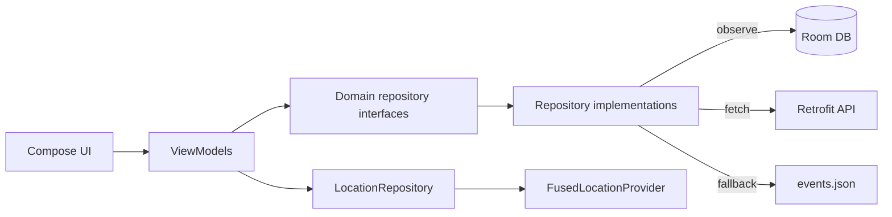
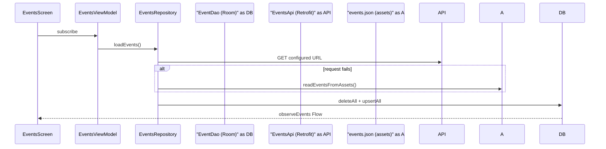

## EventPlanner — Local Events Explorer

Kotlin **Jetpack Compose** app for browsing nearby-style events: list, details, bookmarks, optional distance from coarse location, and **Open in Maps**.

### Features

- **MVVM** + **Hilt**, **Navigation Compose**
- **Retrofit / OkHttp** (disk cache) + **Coil** for images
- **Room** for events and bookmarks
- **Startup load**: fetch JSON once, persist to Room; UI observes the database
- **Quality**: ktlint, GitHub Actions runs `./gradlew check`, JVM unit tests under `app/src/test`

### Requirements

Android Studio (current stable), **JDK 17**, device or emulator **API 24+**.

### Run

1. Open the project in Android Studio.  
2. Sync Gradle.  
3. Run the **`app`** configuration.

### Screens

| Area | Notes |
|------|--------|
| **Events** | List, bookmark toggle, distance when location permission granted |
| **Details** | Full info, bookmark, Maps deep link |
| **Bookmarks** | Saved events from Room |

### Events data & configuration

The remote URL is **`EVENTS_BASE_URL` + `EVENTS_PATH`** in `app/build.gradle.kts`. The app requests that URL with Retrofit; if the call fails, it reads **`app/src/main/assets/events.json`** (same JSON shape).

Default remote points at this repo’s **`events.json` on GitHub** (`raw.githubusercontent.com`, `main` branch). If your default branch is not `main`, or the file is not on that branch yet, the network step may fail and the **bundled asset** is used instead—expected until the repo matches.

Expected JSON: array of objects with (at least) `id`, `title`, `locationName`, `latitude`, `longitude`, `startTimeEpochMillis`, `imageUrl`.

### Gradle

```bash
./gradlew test      # unit tests
./gradlew ktlintCheck
./gradlew check     # tests + lint + compile checks used in CI
```

### Architecture



### Sequence (first load)



### Unit tests

Includes **`CachePolicyTest`**, **`FormattersTest`**, **`EventMappersTest`**.

### Demo Video

https://github.com/user-attachments/assets/440f25ec-7e39-4a2c-ba6e-39aea8c7edd1


