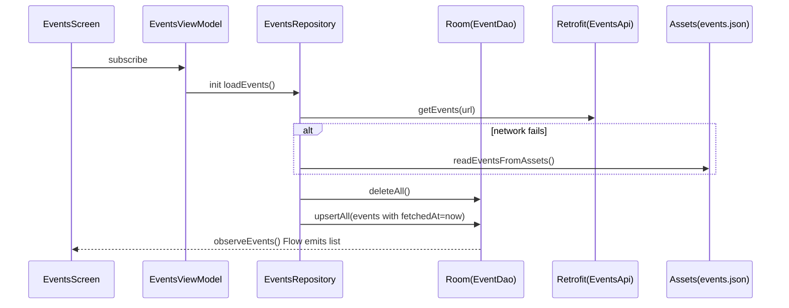

## EventPlanner — Local Events Explorer (Assignment 1)

Kotlin + Jetpack Compose implementation of **“Local Events Explorer”** with:
- **MVVM + DI (Hilt)**
- **Remote API integration (Retrofit/OkHttp)** with **fallback** to bundled JSON for offline demo
- **Local persistence (Room)** for **last-fetched events** + **bookmarks**
- **Caching**: HTTP cache (OkHttp) + image cache (Coil)
- **Native features**: coarse location permission → distance to event, plus **deep link to Maps**
- **Startup load**: events list is populated once from the **API** (with **asset fallback** when the network fails)
- **Engineering standards**: ktlint + basic CI workflow
- **Unit tests**: 3 JVM unit tests for core logic

### Requirements
- Android Studio (latest stable)
- JDK 17 (recommended for Gradle/AGP)
- Android device/emulator (API 24+)

### Run steps
1. Open the project in Android Studio.
2. Sync Gradle.
3. Run the `app` configuration.

### Configure the remote API (optional)
The repository attempts a remote fetch first, then falls back to `app/src/main/assets/events.json`.

To use a real mock REST endpoint:
- Edit `app/build.gradle.kts`:
  - `BuildConfig.EVENTS_BASE_URL`
  - `BuildConfig.EVENTS_PATH`

Expected response shape: JSON array of events:

```json
[
  {
    "id": "evt_1",
    "title": "…",
    "locationName": "…",
    "latitude": 12.97,
    "longitude": 77.64,
    "startTimeEpochMillis": 1777565400000,
    "imageUrl": "https://…"
  }
]
```

### Key screens
- **Events**: list of cached events + bookmark toggle + optional distance (location permission)
- **Details**: event info + bookmark toggle + **Open in Maps**
- **Bookmarks**: locally persisted bookmarks

### Caching strategy
- **Events**:
  - Fetched once when the Events screen view model starts (`loadEvents()`): Retrofit first, then `events.json` if the request fails
  - Stored in Room with `fetchedAtEpochMillis` for metadata
- **HTTP**: OkHttp configured with a disk cache (10 MB)
- **Images**: Coil handles memory + disk caching by default

### Engineering standards
- **Architecture**: single-activity app with Compose Navigation; MVVM per screen
- **Separation of concerns**:
  - `data/*`: Retrofit/Room implementations and mappers
  - `domain/*`: models + repository interfaces + pure logic (`CachePolicy` utilities)
  - `ui/*`: Compose screens, viewmodels, formatters
- **Lint**: ktlint configured in Gradle
- **CI**: GitHub Actions workflow runs `./gradlew check`

### Useful Gradle commands
```bash
./gradlew test
./gradlew ktlintCheck
./gradlew check
```

### Unit tests (3)
- `CachePolicyTest` — TTL staleness decision
- `FormattersTest` — distance formatting
- `EventMappersTest` — mapping DTO/entity/domain

### Architecture diagram
```mermaid
flowchart LR
  UI[Compose UI] --> VM[ViewModels]
  VM --> DR[Domain Repos (interfaces)]
  DR --> R[Data Repos (impl)]
  R -->|observe| Room[(Room DB)]
  R -->|fetch| Retrofit[Retrofit API]
  R -->|fallback| Assets[events.json]
  VM --> Loc[LocationRepository] --> Fused[FusedLocationProvider]
```

### Sequence diagram (initial load + cache)


### Demo video (3 minutes)
Suggested flow:
1. Show Events list (with images), bookmark a couple of events.
2. Open Details, use “Open in Maps”.
3. Open Bookmarks tab.
4. Toggle airplane mode and relaunch to show offline data still present.
5. Mention HTTP/image caching and offline Room data after first load.

